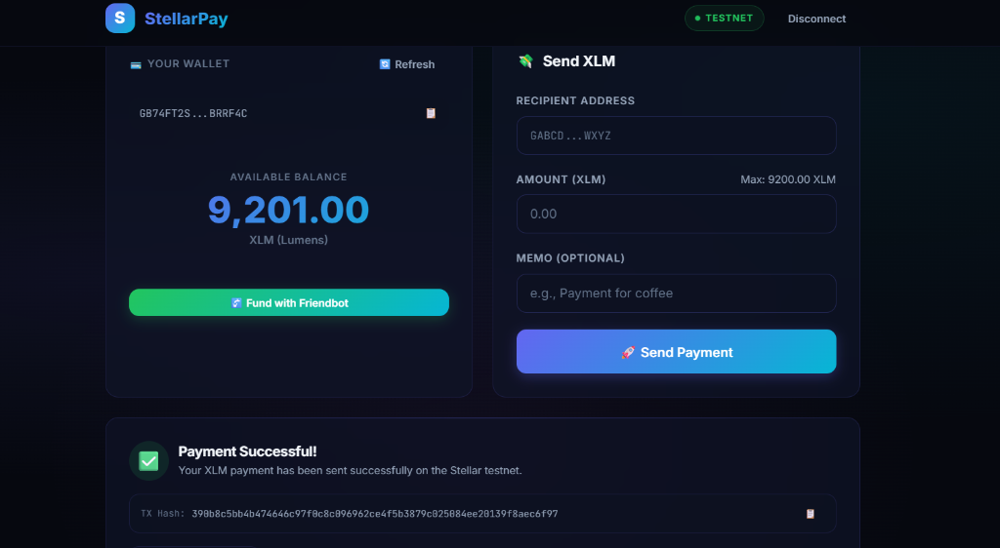

# 🚀 StellarPay — Stellar Testnet Payment Dashboard

StellarPay is a sleek, modern decentralized application (dApp) for sending **XLM payments** on the **Stellar testnet**. Built with React and the Stellar SDK, it provides a seamless wallet-to-wallet payment experience with real-time balance tracking and transaction feedback — all wrapped in a stunning glassmorphism UI.

---

## ✨ Features

- **🔗 Freighter Wallet Integration** — Connect/disconnect your Freighter browser wallet with one click.
- **💰 Live Balance Display** — View your real-time XLM balance, auto-refreshed on every action.
- **💸 Send XLM Payments** — Transfer XLM to any Stellar testnet address with an optional memo field.
- **🚰 Testnet Faucet** — Fund your account instantly via Stellar's Friendbot.
- **✅ Transaction Feedback** — See success/error status with the full transaction hash and a link to the Stellar explorer.
- **📋 Copy-to-Clipboard** — Easily copy your public key and transaction hashes.
- **🎨 Premium Dark UI** — Glassmorphism design with smooth micro-animations and responsive layout.

---

## 📄 Contract Information

- **Network**: Stellar Testnet
- **Contract ID**: `CBYEI2DKWGOPKJH6GYK7LDAHPAR4NG6ONYVY5N7U7ENME6Z7S5Q6G7RR`
- **Explorer Link**: [View on StellarExpert](https://stellar.expert/explorer/testnet/contract/CBYEI2DKWGOPKJH6GYK7LDAHPAR4NG6ONYVY5N7U7ENME6Z7S5Q6G7RR)
- **Verified Interaction**: [View Transaction on StellarExpert](https://stellar.expert/explorer/testnet/tx/65950d668b6b379c325bd814552fa2f7a56467bd15af1d09e4f020a6e7f8bb9b)
- **Transaction Hash**: `65950d668b6b379c325bd814552fa2f7a56467bd15af1d09e4f020a6e7f8bb9b`

---


## 🛠️ Tech Stack

| Layer        | Technology                                                                 |
| ------------ | -------------------------------------------------------------------------- |
| **Frontend** | [React 18](https://react.dev/) + [Vite 5](https://vitejs.dev/)            |
| **Stellar**  | [@stellar/stellar-sdk](https://github.com/stellar/js-stellar-sdk) v12     |
| **Wallet**   | [@stellar/freighter-api](https://github.com/nicholasgasior/freighter-api) |
| **Network**  | Stellar Testnet (`https://horizon-testnet.stellar.org`)                    |
| **Styling**  | Vanilla CSS (custom glassmorphism design system)                           |

---

## 📦 Prerequisites

Before running the project, make sure you have:

1. **Node.js** (v18 or later) — [Download](https://nodejs.org/)
2. **npm** (comes bundled with Node.js)
3. **Freighter Wallet** browser extension — [Install for Chrome/Brave](https://www.freighter.app/)

> **Important:** After installing Freighter, switch the network to **Testnet** in the extension settings.

---

## 🚀 Setup & Run Locally

```bash
# 1. Clone the repository
git clone https://github.com/anjay1011/stellar_level1.git
cd stellar_level1

# 2. Install dependencies
npm install

# 3. Start the development server
npm run dev
```

The app will be available at **`http://localhost:5173`** (default Vite port).

### Production Build

```bash
# Build for production
npm run build

# Preview the production build
npm run preview
```

---

## 📸 Screenshots

### Wallet Connected + Balance Displayed + Successful Transaction

The screenshot below shows the complete StellarPay dashboard with:

1. **Wallet connected** — The Freighter wallet is connected, displaying the truncated public key (`GB74FT2S...BRRF4C`) with a copy button.
2. **Balance displayed** — The available balance is shown in real-time (**9,201.00 XLM**).
3. **Successful testnet transaction** — A payment was sent successfully on the Stellar testnet.
4. **Transaction result shown** — The "Payment Successful!" confirmation card displays the full transaction hash with a copy button.



---

## 📁 Project Structure

```
stellar-pay/
├── public/                  # Static assets
├── src/
│   ├── components/
│   │   ├── Header.jsx       # Top nav with wallet connect/disconnect
│   │   ├── WalletCard.jsx   # Wallet info, balance, Friendbot funding
│   │   ├── SendPayment.jsx  # XLM transfer form
│   │   ├── TransactionResult.jsx  # Success/error result card
│   │   ├── FreighterDetect.jsx    # Freighter install detection banner
│   │   └── Footer.jsx       # App footer
│   ├── hooks/
│   │   └── useStellar.js    # Core Stellar logic (connect, send, balance)
│   ├── services/
│   │   └── stellar.js       # Stellar SDK service layer
│   ├── App.jsx              # Main application layout
│   ├── main.jsx             # React entry point
│   └── index.css            # Global styles & design system
├── screenshots/             # README screenshots
├── index.html               # HTML entry point
├── package.json
├── vite.config.js
└── README.md
```

---

## 🔧 How It Works

1. **Connect Wallet** — Click "Connect Freighter Wallet" to link your Stellar testnet account via the Freighter browser extension.
2. **View Balance** — Your XLM balance is automatically fetched from Stellar Horizon and displayed in real-time.
3. **Fund Account** — Use the "Fund with Friendbot" button to request free testnet XLM from Stellar's faucet.
4. **Send Payment** — Enter a recipient's Stellar address, an amount, and an optional memo, then hit "Send Payment." The transaction is signed by Freighter and submitted to the testnet.
5. **View Result** — A success or error card appears with the transaction hash, which you can copy or look up on the Stellar Explorer.

---

## 📄 License

This project is open-source and available under the [MIT License](LICENSE).

---

<p align="center">
  Built with 💜 on the <a href="https://stellar.org">Stellar Network</a>
</p>
